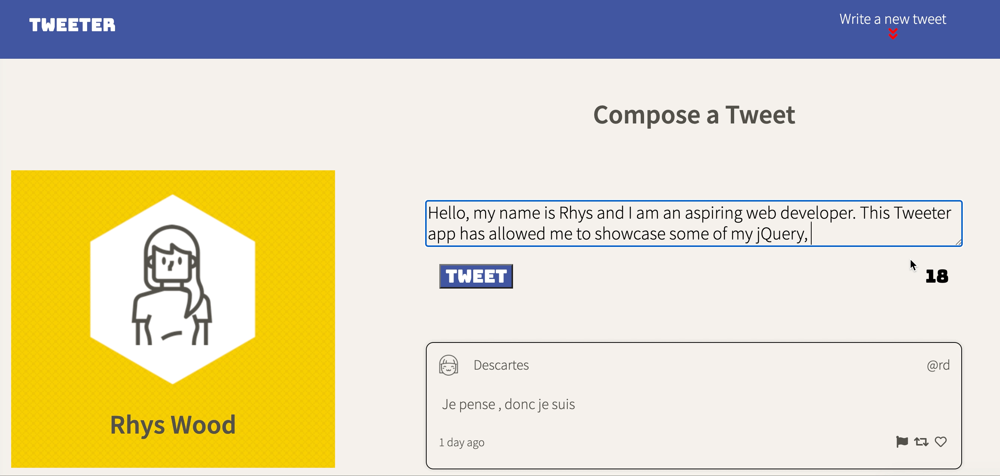

# Tweeter Project

Tweeter is a simple, single-page Twitter clone.

This project required HTML, CSS, JS, jQuery and AJAX front-end skills, along with Node and Express back-end skills.

## Getting Started

1. Clone this repository onto your local device.
2. Install dependencies using the `npm install` command.
3. Start the web server using the `npm start` command. The app will be served at <http://localhost:8080/>.
4. Go to <http://localhost:8080/> in your browser.
5. Enjoy! 

## Things to Note

>Character Counter -- Using jQuery I was able to impliment a real time character counter, turning red once the count surpasses 140 characters.

>Using CSS Media Queries, I created a dynamic web app which switches to a mobile layout once the width shrinks below 1024px.

## Dependencies

- Express
- Node 5.10.x or above
- Chance
- Body-Parser
- md5
